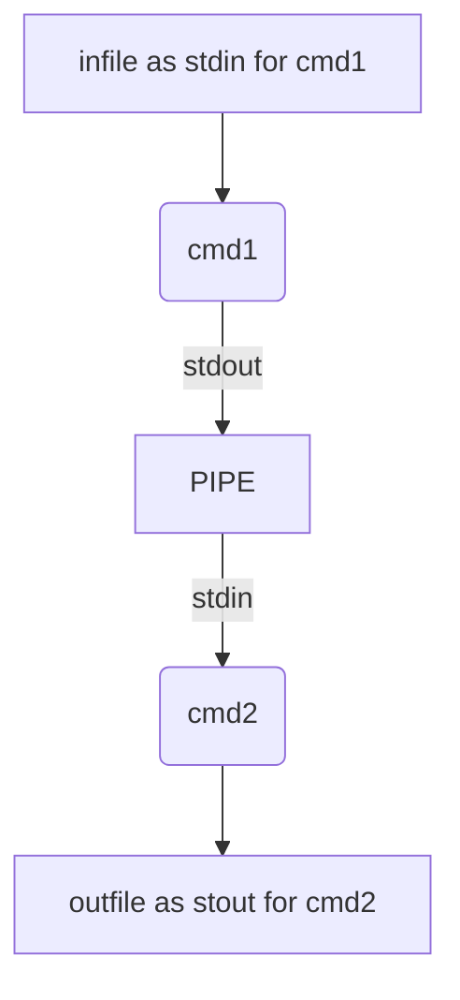

# Pipex-42
---



This program takes the infile, outfile to redirect the STDIN (<), STDOUT (>) and 2 commands to pipe.

```
$> ./pipex file1 cmd1 cmd2 file2
```

As mentioned before, this project is done with the help of a new set of tools: pipes, forks and dups, among others. Here's a brief description of what these functions do:

| Function | Descripton | Return Value |
| :-------:| :---------:| :----------: |
| ``pipe(fd)`` | Recives a ``fd[2]`` and opens ``fd[0]`` for reading and ``fd[1]`` for writing | ``-1`` on error |
| ``fork()`` | Splits process creating a child process with pid ``0`` | Process id of both processess (child = ``0``, parent > ``0``), ``-1`` on error |
| ``dup2(oldfd, newfd)`` | Closes ``newfd`` if needed, then duplicates ``oldfd`` into ``newfd`` | ``-1`` on error |
| ``execve(path, cmd, envp)`` | Receives full path of executable, NULL-terminated array of parameters, and environment. Replaces current process with that of the specified command | ``-1`` on error |

## Sources
---

* [**Unix Processes in C**](https://www.youtube.com/playlist?list=PLfqABt5AS4FkW5mOn2Tn9ZZLLDwA3kZUY) a good youtube playlist to inderstanding  how processing works in c .
* [**Pipex Cookbook**](https://csnotes.medium.com/pipex-tutorial-42-project-4469f5dd5901)
* [**PReproducing the Pipe Operator “|” in C**](https://www.codequoi.com/en/pipex-reproducing-the-pipe-operator-in-c/)
